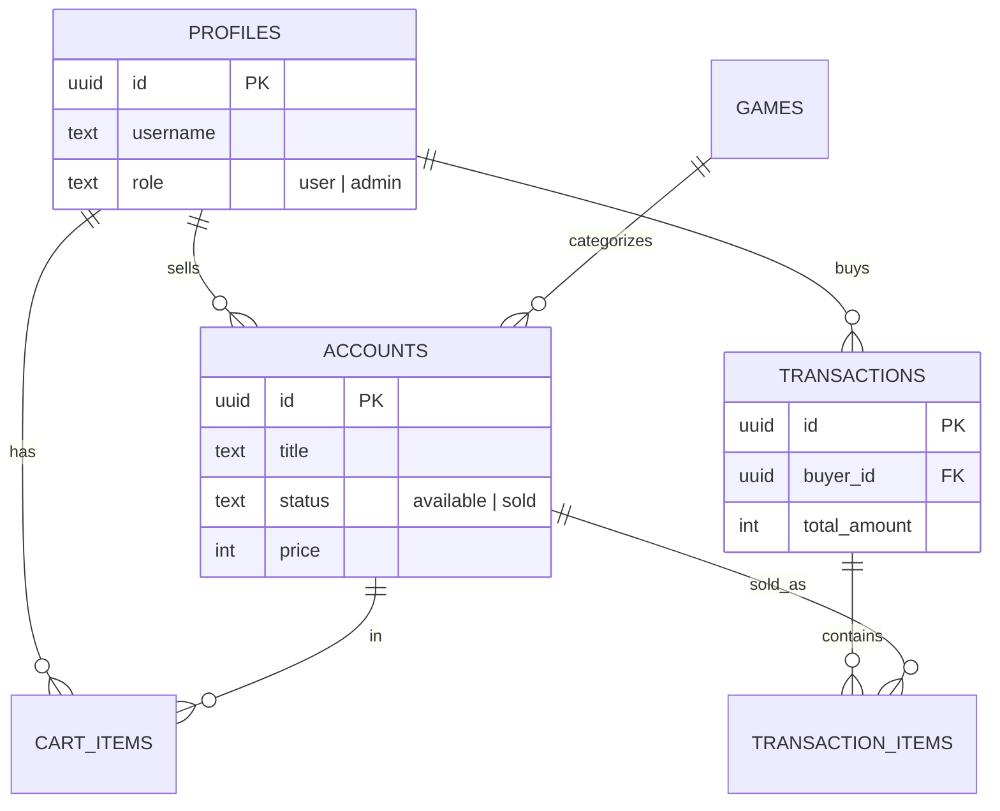

<p align="center">
  
  
  
  
  
</p>

<h1 align="center">🎮 GameMarket</h1>

<p align="center">
  <strong>Marketplace Jual Beli Akun Game Terpercaya dengan Sistem Transaksi Terintegrasi</strong>
</p>

<p align="center">
  Platform jual beli akun <b>Valorant</b>, <b>Mobile Legends</b>, dan <b>PUBG Mobile</b> yang aman.<br/>
  Dilengkapi dengan Dashboard Analitik, Sistem Keranjang, dan Transaksi Otomatis.
</p>

<p align="center">
  <a href="#-fitur-utama">Fitur</a> •
  <a href="#%EF%B8%8F-tech-stack">Tech Stack</a> •
  <a href="#-arsitektur">Arsitektur</a> •
  <a href="#-getting-started">Getting Started</a> •
  <a href="#-database-schema">Database</a> •
  <a href="#-struktur-folder">Folder</a>
</p>

---

## ✨ Fitur Utama

### 🏪 Marketplace & Transaksi (NEW!)
- **Sistem Keranjang (Cart)** — Simpan beberapa akun sekaligus sebelum melakukan pembayaran.
- **Checkout Flow** — Proses pembayaran simulasi dengan pemilihan metode pembayaran (Bank Transfer, QRIS).
- **Riwayat Pembelian** — Dashboard khusus untuk memantau akun-akun yang telah Anda beli.
- **Auto-Sold Status** — Akun otomatis berubah status menjadi `sold` dan hilang dari katalog setelah checkout sukses.

### 📈 Dashboard Analytics (NEW!)
- **Visualisasi Data** — Grafik pendapatan bulanan menggunakan **Recharts**.
- **Metrik Bisnis** — Total revenue, jumlah produk terjual, dan total listing aktif.
- **Top Performing Products** — Daftar produk termahal yang berhasil terjual.

### 📊 Dashboard Penjual & Pembeli
- **Kelola Dagangan** — Tabel responsif untuk memantau status jualan (Available / Sold).
- **Mark as Sold Manual** — Penjual bisa menandai produk terjual secara manual.
- **Jual Akun Baru** — Form lengkap dengan upload gambar ke Supabase Storage.
- **Pengaturan Profil** — Ubah username dan upload avatar secara instan.

### 🛡️ Admin Panel
- **Monitoring Seluruh Sistem** — Admin dapat memantau semua postingan dari seluruh penjual.
- **Tindakan Moderasi** — Hapus paksa postingan yang melanggar atau ubah status produk secara manual.
- **RBAC (Role-Based Access Control)** — Proteksi ketat halaman admin di level server.

### 🎨 UI / UX Premium (Production Ready)
- **Dark Mode Aesthetic** — Menggunakan palet slate yang elegan dengan sentuhan glassmorphism.
- **Loading Skeletons** — Animasi pulse saat data sedang dimuat (Halaman Utama & Dashboard).
- **Global Error Handling** — Layar error kustom yang cantik jika terjadi kegagalan sistem.
- **Empty State UI** — Ilustrasi menarik saat keranjang atau daftar jualan sedang kosong.
- **SweetAlert2** — Notifikasi interaktif yang responsif untuk setiap tindakan user.

---

## ⚙️ Tech Stack

| Layer | Teknologi | Keterangan |
|-------|-----------|------------|
| **Framework** | [Next.js 16](https://nextjs.org) | App Router, Server Components, Server Actions |
| **UI Library** | [React 19](https://react.dev) | `useActionState` & dynamic imports |
| **Styling** | [Tailwind CSS 4](https://tailwindcss.com) | Modern CSS utility-first framework |
| **Analytics** | [Recharts](https://recharts.org) | SVG-based charting library |
| **Notifications** | [SweetAlert2](https://sweetalert2.github.io) | Beautiful, responsive, customizable popups |
| **Backend / BaaS** | [Supabase](https://supabase.com) | PostgreSQL, Auth, Storage, RLS |
| **Auth** | Supabase Auth | Cookie-based session management |
| **Bahasa** | [TypeScript 5](https://typescriptlang.org) | Type safety everywhere |

---

## 🚀 Getting Started

### 1. Clone & Install
```bash
git clone https://github.com/username/game-store-management.git
cd game-store-management
npm install
```

### 2. Setup Database (Supabase)
Jalankan script SQL berikut di SQL Editor Supabase:

<details>
<summary>📄 <strong>Klik untuk melihat SQL Schema Lengkap</strong></summary>

```sql
-- 1. Tabel Utama (Profiles, Games, Accounts)
-- [Lihat di file schema asli...]

-- 2. Tabel Transaksi
CREATE TABLE transactions (
  id UUID DEFAULT gen_random_uuid() PRIMARY KEY,
  buyer_id UUID REFERENCES profiles(id) ON DELETE CASCADE NOT NULL,
  total_amount INTEGER NOT NULL,
  status TEXT DEFAULT 'pending',
  payment_method TEXT DEFAULT 'transfer_bank',
  created_at TIMESTAMPTZ DEFAULT now()
);

CREATE TABLE transaction_items (
  id UUID DEFAULT gen_random_uuid() PRIMARY KEY,
  transaction_id UUID REFERENCES transactions(id) ON DELETE CASCADE NOT NULL,
  account_id UUID REFERENCES accounts(id) ON DELETE SET NULL,
  price INTEGER NOT NULL,
  created_at TIMESTAMPTZ DEFAULT now()
);

-- 3. Tabel Keranjang
CREATE TABLE cart_items (
  id UUID DEFAULT gen_random_uuid() PRIMARY KEY,
  user_id UUID REFERENCES profiles(id) ON DELETE CASCADE NOT NULL,
  account_id UUID REFERENCES accounts(id) ON DELETE CASCADE NOT NULL,
  created_at TIMESTAMPTZ DEFAULT now(),
  UNIQUE(user_id, account_id)
);
```
</details>

---

## 🗃 Database Schema



---

## 📁 Struktur Folder Utama

```
game-store-management/
├── actions/              # Server Actions (auth, accounts, cart, checkout)
├── app/                  # App Router Routes
│   ├── (marketplace)/    # Public pages, cart, checkout
│   ├── dashboard/        # Seller area (analytics, manage, purchases)
│   ├── admin/            # Admin monitoring area
│   ├── loading.tsx       # Root skeleton
│   └── error.tsx         # Global error boundary
├── components/           # UI & Shared Components
│   ├── shared/           # AnalyticsChart, AddToCart, EmptyState, Navbar
│   └── ui/               # SubmitButton, Base components
├── lib/                  # Supabase config & Utilities
└── types/                # Database types
```

---

<p align="center">
  Dibuat oleh <strong>GHIFARY BARRA VASSKA</strong> untuk <strong>Portofolio</strong>
</p>
