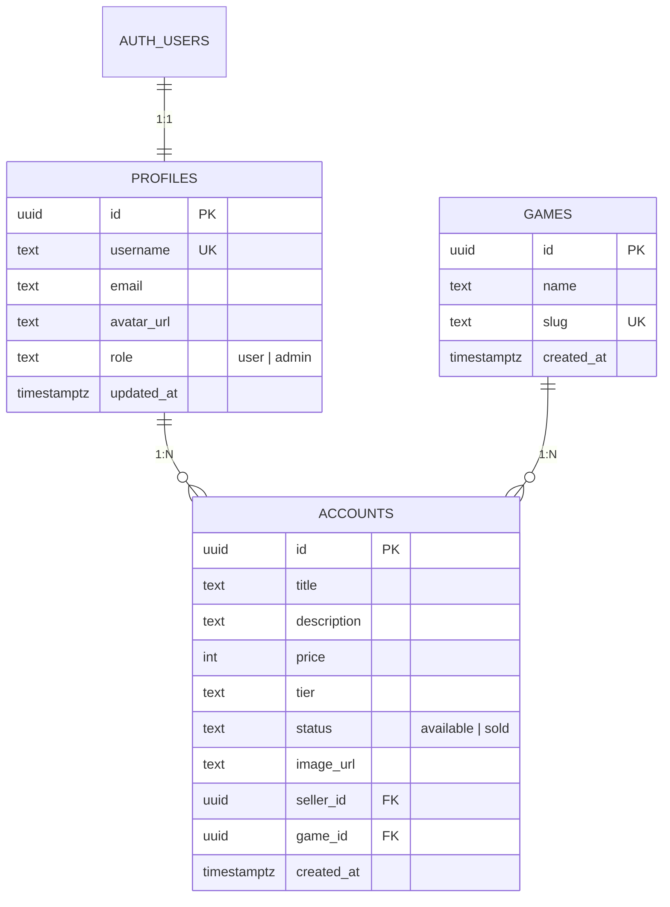

<p align="center">
  
  
  
  
  
</p>

<h1 align="center">🎮 GameMarket</h1>

<p align="center">
  <strong>Marketplace Jual Beli Akun Game Terpercaya</strong>
</p>

<p align="center">
  Platform jual beli akun <b>Valorant</b>, <b>Mobile Legends</b>, dan <b>PUBG Mobile</b> yang aman.<br/>
  Transaksi cepat, garansi anti hack-back.
</p>

<p align="center">
  <a href="#-fitur-utama">Fitur</a> •
  <a href="#%EF%B8%8F-tech-stack">Tech Stack</a> •
  <a href="#-arsitektur">Arsitektur</a> •
  <a href="#-getting-started">Getting Started</a> •
  <a href="#-database-schema">Database</a> •
  <a href="#-struktur-folder">Folder</a>
</p>

---

## ✨ Fitur Utama

### 🏪 Marketplace Publik
- **Hero section** dengan gradient interaktif dan CTA ganda (Jelajahi / Mulai Jualan)
- **Pencarian & filter dinamis** — cari berdasarkan judul, filter per game, rentang harga min/max
- **Kartu akun** dengan preview gambar, tier/rank badge, harga dalam Rupiah, dan info penjual
- **Halaman detail akun** lengkap dengan breadcrumb, gambar besar, profil penjual, deskripsi, dan tombol hubungi via WhatsApp
- **Skeleton loading state** untuk pengalaman pengguna yang mulus saat data sedang dimuat
- **Navigasi per game** — halaman khusus Valorant, MLBB, dan PUBG Mobile

### 🔐 Autentikasi & Otorisasi
- **Register** dengan email & password (verifikasi email via Supabase)
- **Login** dengan email & password (Supabase Auth)
- **Logout** secara real-time dari client-side
- **Middleware** untuk menjaga session tetap segar (auto-refresh token)
- **Role-Based Access Control (RBAC)** — role `user` dan `admin` dari tabel `profiles`

### 📊 Dashboard Penjual
- **Kelola dagangan** — lihat semua akun yang dijual dalam tabel responsif (produk, game, harga, status)
- **Hapus listing** sendiri dengan security check ganda (client + RLS)
- **Jual akun baru** — form lengkap: judul, pilih game, tier/rank, harga, deskripsi, upload screenshot
- **Upload gambar** ke Supabase Storage (`account_images` bucket) dengan nama file unik
- **Pengaturan profil** — ubah username publik & upload foto avatar (`avatars` bucket)
- **Sidebar navigasi** dengan tips penjualan

### 🛡️ Admin Panel
- **Proteksi layout** — hanya user dengan `role: admin` yang bisa akses `/admin`
- **Monitoring postingan** — lihat semua listing dari semua penjual
- **Hapus paksa** — admin bisa menghapus listing yang melanggar
- **Force-dynamic rendering** untuk data selalu fresh
- **Sidebar admin** terpisah dengan navigasi ke halaman pengguna

### 🎨 UI / UX
- **Dark mode** premium dengan palet slate
- **Glassmorphism** navbar (`backdrop-blur-md`)
- **Animasi halus** menggunakan Framer Motion (hover lift pada kartu, navbar slide-in)
- **Responsive design** — mobile-first, sidebar berubah jadi horizontal scroll di mobile
- **Tipografi Inter** dari Google Fonts
- **Format Rupiah (IDR)** otomatis di seluruh aplikasi

---

## ⚙️ Tech Stack

| Layer | Teknologi | Keterangan |
|-------|-----------|------------|
| **Framework** | [Next.js 16](https://nextjs.org) | App Router, Server Components, Server Actions |
| **UI Library** | [React 19](https://react.dev) | `useActionState` untuk form handling |
| **Styling** | [Tailwind CSS 4](https://tailwindcss.com) | `@import "tailwindcss"` syntax |
| **Animasi** | [Framer Motion](https://motion.dev) | Hover effects, entrance animations |
| **Backend / BaaS** | [Supabase](https://supabase.com) | Auth, PostgreSQL, Storage, Row-Level Security |
| **Auth** | Supabase Auth + `@supabase/ssr` | Cookie-based, SSR-compatible |
| **Bahasa** | [TypeScript 5](https://typescriptlang.org) | Strict typing |
| **Linting** | [ESLint 9](https://eslint.org) + `eslint-config-next` | Code quality |

---

## 🏗 Arsitektur

```
┌────────────────────────────────────────────────────────┐
│                     BROWSER (Client)                   │
│  ┌──────────┐  ┌────────────┐  ┌────────────────────┐  │
│  │  Navbar   │  │ AccountCard│  │ SellForm/Settings  │  │
│  │ (motion)  │  │  (motion)  │  │  (useActionState)  │  │
│  └──────────┘  └────────────┘  └────────────────────┘  │
└───────────────────────┬────────────────────────────────┘
                        │ Server Actions + SSR
┌───────────────────────▼────────────────────────────────┐
│                   NEXT.JS SERVER                        │
│  ┌────────────────────────────────────────────────────┐ │
│  │ middleware.ts — Refresh session di setiap request  │ │
│  ├────────────────────────────────────────────────────┤ │
│  │ Server Components (page.tsx)                       │ │
│  │  • Data fetching langsung via Supabase client      │ │
│  │  • Dynamic filtering (searchParams)                │ │
│  ├────────────────────────────────────────────────────┤ │
│  │ Server Actions (actions/*.ts)                      │ │
│  │  • createAccount — insert + upload image           │ │
│  │  • deleteAccount — delete + ownership check        │ │
│  │  • login / signup — Supabase Auth                  │ │
│  │  • updateProfile — update username + avatar        │ │
│  └────────────────────────────────────────────────────┘ │
└───────────────────────┬────────────────────────────────┘
                        │ Supabase Client (SSR)
┌───────────────────────▼────────────────────────────────┐
│                    SUPABASE (Cloud)                      │
│  ┌──────────┐  ┌───────────┐  ┌──────────────────────┐ │
│  │   Auth    │  │ PostgreSQL│  │      Storage         │ │
│  │ (email +  │  │ • accounts│  │ • account_images     │ │
│  │ password) │  │ • profiles│  │ • avatars            │ │
│  │           │  │ • games   │  │                      │ │
│  └──────────┘  └───────────┘  └──────────────────────┘ │
│                      RLS (Row-Level Security)           │
└─────────────────────────────────────────────────────────┘
```

---

## 🚀 Getting Started

### Prasyarat

- **Node.js** ≥ 18
- **npm**, **yarn**, **pnpm**, atau **bun**
- Akun [Supabase](https://supabase.com) (gratis)

### 1. Clone Repository

```bash
git clone https://github.com/username/game-store-management.git
cd game-store-management
```

### 2. Install Dependencies

```bash
npm install
```

### 3. Setup Environment Variables

Buat file `.env.local` di root project:

```env
NEXT_PUBLIC_SUPABASE_URL=https://your-project.supabase.co
NEXT_PUBLIC_SUPABASE_ANON_KEY=your-anon-key
```

> 💡 Dapatkan kedua value ini dari **Supabase Dashboard** → **Settings** → **API**

### 4. Setup Database Supabase

Buat tabel-tabel berikut di Supabase SQL Editor:

<details>
<summary>📄 <strong>Klik untuk melihat SQL Schema</strong></summary>

```sql
-- Tabel games (daftar game yang didukung)
CREATE TABLE games (
  id UUID DEFAULT gen_random_uuid() PRIMARY KEY,
  name TEXT NOT NULL,
  slug TEXT UNIQUE NOT NULL,
  created_at TIMESTAMPTZ DEFAULT now()
);

-- Seed data game
INSERT INTO games (name, slug) VALUES
  ('Valorant', 'valorant'),
  ('Mobile Legends: Bang Bang', 'mlbb'),
  ('PUBG Mobile', 'pubgm');

-- Tabel profiles (profil pengguna)
CREATE TABLE profiles (
  id UUID REFERENCES auth.users ON DELETE CASCADE PRIMARY KEY,
  username TEXT UNIQUE,
  email TEXT,
  avatar_url TEXT,
  role TEXT DEFAULT 'user',
  updated_at TIMESTAMPTZ DEFAULT now()
);

-- Tabel accounts (listing akun game yang dijual)
CREATE TABLE accounts (
  id UUID DEFAULT gen_random_uuid() PRIMARY KEY,
  title TEXT NOT NULL,
  description TEXT,
  price INTEGER NOT NULL,
  tier TEXT NOT NULL,
  status TEXT DEFAULT 'available',
  image_url TEXT,
  seller_id UUID REFERENCES profiles(id) ON DELETE CASCADE NOT NULL,
  game_id UUID REFERENCES games(id) ON DELETE CASCADE NOT NULL,
  created_at TIMESTAMPTZ DEFAULT now()
);
```

</details>

### 5. Setup Supabase Storage

Buat 2 bucket di **Supabase Dashboard** → **Storage**:

| Bucket | Public | Keterangan |
|--------|--------|------------|
| `account_images` | ✅ Yes | Screenshot/bukti akun game |
| `avatars` | ✅ Yes | Foto profil pengguna |

### 6. Jalankan Development Server

```bash
npm run dev
```

Buka [http://localhost:3000](http://localhost:3000) di browser.

---

## 🗃 Database Schema



---

## 📁 Struktur Folder

```
game-store-management/
├── app/                          # Next.js App Router
│   ├── layout.tsx                # Root layout (Navbar, auth check, role)
│   ├── page.tsx                  # Homepage (hero + marketplace + filter)
│   ├── loading.tsx               # Global skeleton loading UI
│   ├── template.tsx              # Template wrapper
│   ├── globals.css               # Tailwind CSS + custom properties
│   │
│   ├── auth/                     # Halaman autentikasi
│   │   ├── login/page.tsx        # Form login
│   │   ├── register/page.tsx     # Form registrasi
│   │   └── games/[slug]/         # Halaman per game
│   │
│   ├── accounts/                 # Detail akun
│   │   └── [id]/page.tsx         # Halaman detail + WA contact
│   │
│   ├── sell/                     # Jual akun
│   │   └── page.tsx              # Form posting akun baru
│   │
│   ├── dashboard/                # Area penjual
│   │   ├── layout.tsx            # Sidebar navigasi penjual
│   │   ├── page.tsx              # Tabel kelola dagangan
│   │   └── settings/page.tsx     # Form pengaturan profil
│   │
│   └── admin/                    # Area admin
│       ├── layout.tsx            # Sidebar admin + role guard
│       └── page.tsx              # Monitoring semua postingan
│
├── actions/                      # Server Actions (React 19)
│   ├── accounts.ts               # createAccount, deleteAccount
│   ├── auth.ts                   # login, signup
│   └── profiles.ts               # updateProfile
│
├── components/
│   ├── shared/                   # Komponen bersama
│   │   ├── Navbar.tsx            # Navigasi global + role-aware
│   │   ├── AccountCard.tsx       # Kartu produk dengan animasi
│   │   ├── SearchFilter.tsx      # Form pencarian & filter
│   │   ├── SellForm.tsx          # Form jual akun
│   │   └── SettingsForm.tsx      # Form pengaturan profil
│   └── ui/                       # Komponen UI primitif
│       └── SubmitButton.tsx      # Tombol submit dengan loading state
│
├── lib/
│   ├── supabase/
│   │   ├── server.ts             # Supabase client (server-side, cookies)
│   │   └── client.ts             # Supabase client (browser-side)
│   └── utils.ts                  # Utility functions
│
├── types/
│   └── supabase.ts               # Supabase type definitions
│
├── middleware.ts                  # Session refresh middleware
├── next.config.ts                # Next.js config (image domains)
├── package.json                  # Dependencies & scripts
├── tsconfig.json                 # TypeScript configuration
└── tailwind.config.ts            # Tailwind configuration
```

---

## 📜 Scripts

| Command | Keterangan |
|---------|------------|
| `npm run dev` | Jalankan development server |
| `npm run build` | Build untuk production |
| `npm run start` | Jalankan production server |
| `npm run lint` | Jalankan ESLint |

---

## 🔒 Keamanan

- **Row-Level Security (RLS)** di Supabase memastikan user hanya bisa memodifikasi data miliknya sendiri
- **Double security check** pada penghapusan akun (client-side check + RLS policy)
- **Middleware session refresh** — setiap request secara otomatis memperbarui token autentikasi
- **Server-side auth guard** — halaman `/sell`, `/dashboard`, dan `/admin` diproteksi di server level
- **RBAC (Role-Based Access Control)** — admin panel hanya bisa diakses oleh user dengan `role: admin`
- **Environment variables** — credentials Supabase disimpan di `.env.local` (tidak di-commit ke Git)

---

## 🤝 Kontribusi

1. Fork repository ini
2. Buat branch baru (`git checkout -b fitur/fitur-baru`)
3. Commit perubahan (`git commit -m 'feat: menambahkan fitur baru'`)
4. Push ke branch (`git push origin fitur/fitur-baru`)
5. Buat Pull Request

---

## 📝 Lisensi

Proyek ini bersifat pribadi dan tidak memiliki lisensi publik.

---

<p align="center">
  Dibuat dengan ❤️ menggunakan <strong>Next.js</strong> + <strong>Supabase</strong>
</p>
